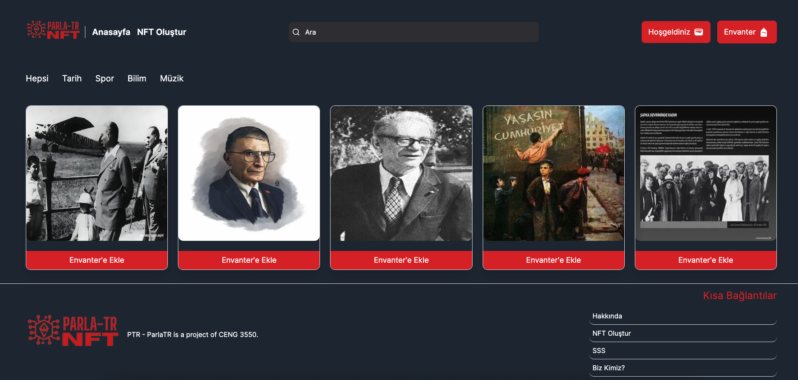

<h1 style="text-align: center;"> ParlaTR [PTR] </h1>

"CENG 3550 - Decentralized Systems and Applications" Dersi Final Projesi

Grup Üyeleri

Fatih Emre YILDIZ | 180702004,1

Halim A. Ceylan | 190709043

<h2 style="text-align: center;"> Proje Hakkında</h2>
ParlaTR bir blokzincir tabanlı Nitelikli Fikri Tapu projesidir. NFT (Nitelikli Fikri Tapu), mülkiyeti ve orijinalliği doğrulamak için kullanılan, blok zinciri üzerinde saklanan türünün tek örneği dijital bir varlıktır (digital asset). Herhangi bir NFT kopyalanamaz, değiştirilemez ve daha küçük parçalara ayrılamaz fakat takas edilebilir. NFT’nin bir çok kullanım alanı vardır, bu kullanım alanlarına sanat eserlerinin tescillenmesi, dijital koleksiyonları ve oyunlardaki eserlerin tescillenmesini örnek verebiliriz. Bu bağlamda, blok zincir tabanlı NFT Pazarı Sistemi geleneksel belgeleme yöntemlerine bir alternatif olarak, bu mirası koruma ve tanıtma potansiyeline sahiptir. Amaç, Cumhuriyet dönemine ait önemli kazanımları NFT olarak dijital ortamda kalıcı (değiştirilemez) olacak şekilde Fikri Tapu Pazarı Sistemi üzerinde kullanıcılarla ücretsiz bir şekilde paylaşmayı (belgelemeyi) hedeflemektedir.

<h2 style="text-align: center;"> Projeyi Çalıştırma </h2>

 Yerel Blokzincir Ağının Çalıştırılması için

npm install

npx hardhat node

----

 
 

 Akıllı Kontratları Yüklemek (Yerel Ağın Çalışması gerekiyor)

npx hardhat run src/backend/scripts/deploy.js --network localhost 

----

 
 

 Önyüz Çalıştırmak İçin

cd src/PTR_NFT_Front/ 

npm install 

npm run dev 

----

 NFT Yüklemek İçin:

Metamask Üzerinden Manuel Ağ Eklemek Gerekiyor 

 
 

<h2 style="text-align: center;"> Proje'nin Fotoğrafları - Photos of Project</h2>

<h2 style="text-align: center;"> Proje Yapısı - Project Structure</h2>

<h1 style="text-align: center;">ParlaTR [PTR]</h1>

Project for "CENG 3550 - Decentralized Systems and Applications"

<h2 style="text-align: center;">About Project</h2>
ParlaTR is a blockchain-based NFT Marketplace project. NFT is a one-of-a-kind digital asset stored on the blockchain that is used to verify ownership and authenticity. Any NFT cannot be copied, modified or broken into smaller pieces, but it can be traded. NFT has many uses, such as the registration of works of art, digital collections and the registration of works in games. In this context, the blockchain-based NFT Market System has the potential to preserve and promote this heritage, as an alternative to traditional documentation methods. The aim is to share (protect) the important achievements of the Republic period with users free of charge on the NFT Marketplace, in a permanent (unchangeable) way in the digital environment as NFT.

<h2 style="text-align: center;"> Run the Project </h2>

 To Run the Local Blockchain Network

npm install

npx hardhat node

----

 
 

 Deploy Smart Contracts (Local Network Required)

npx hardhat run src/backend/scripts/deploy.js --network localhost 

----

 
 

 Run the Frontend

cd src/PTR_NFT_Front/ 

npm install 

npm run dev 

----

 To Load NFTs:

You need to manually add the network via Metamask 

 
 

